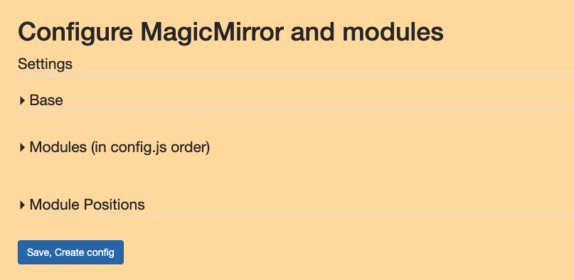
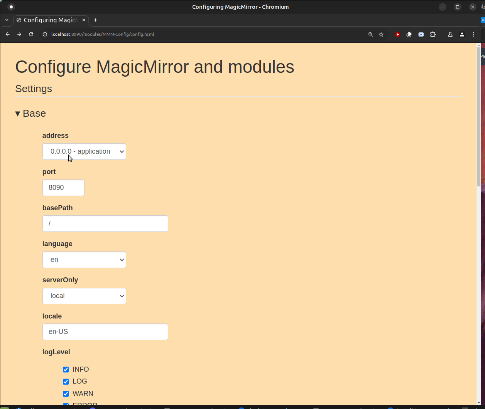
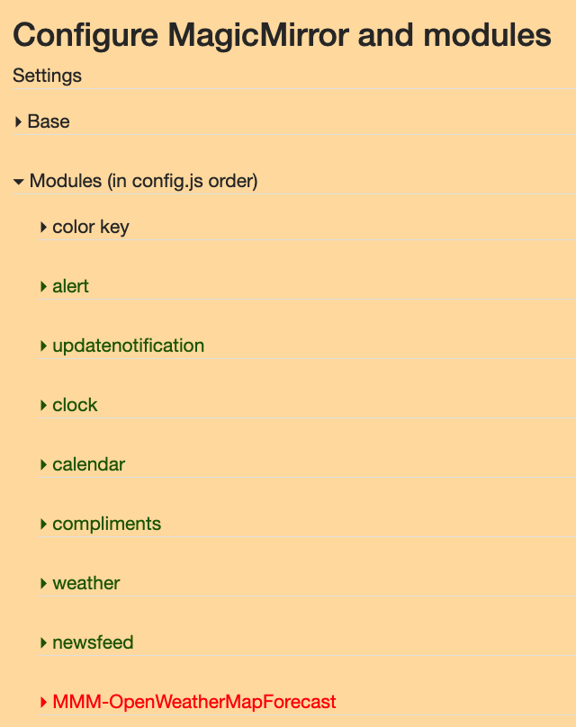
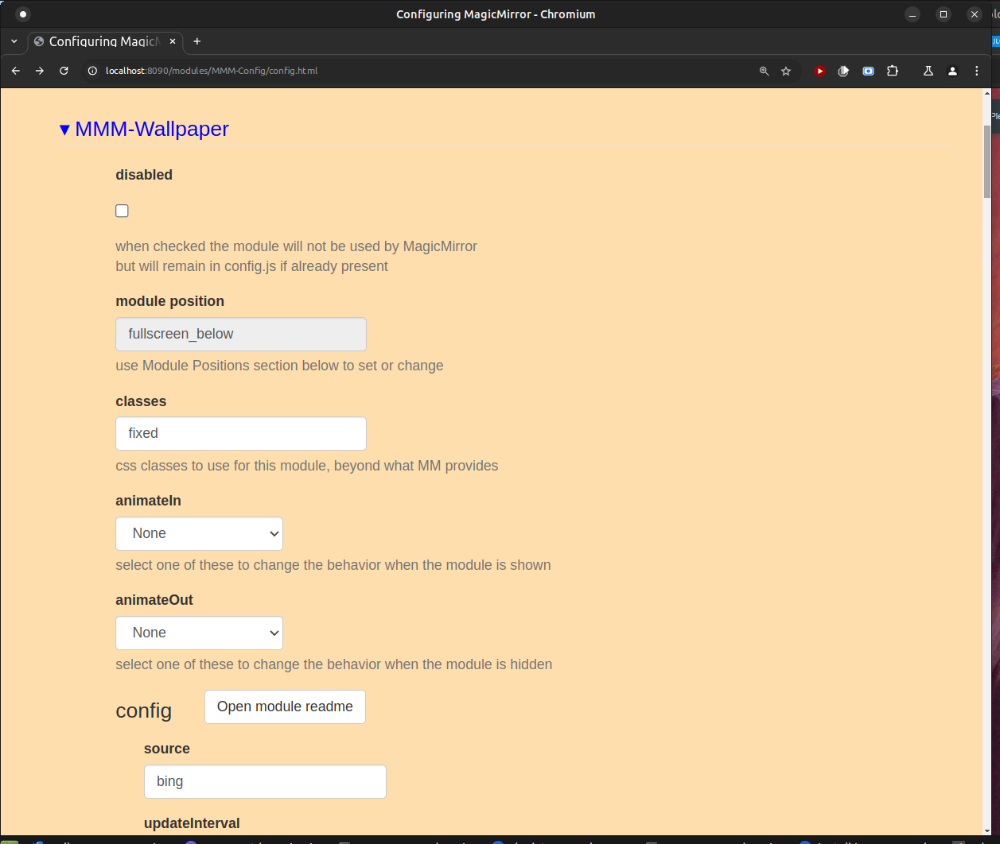
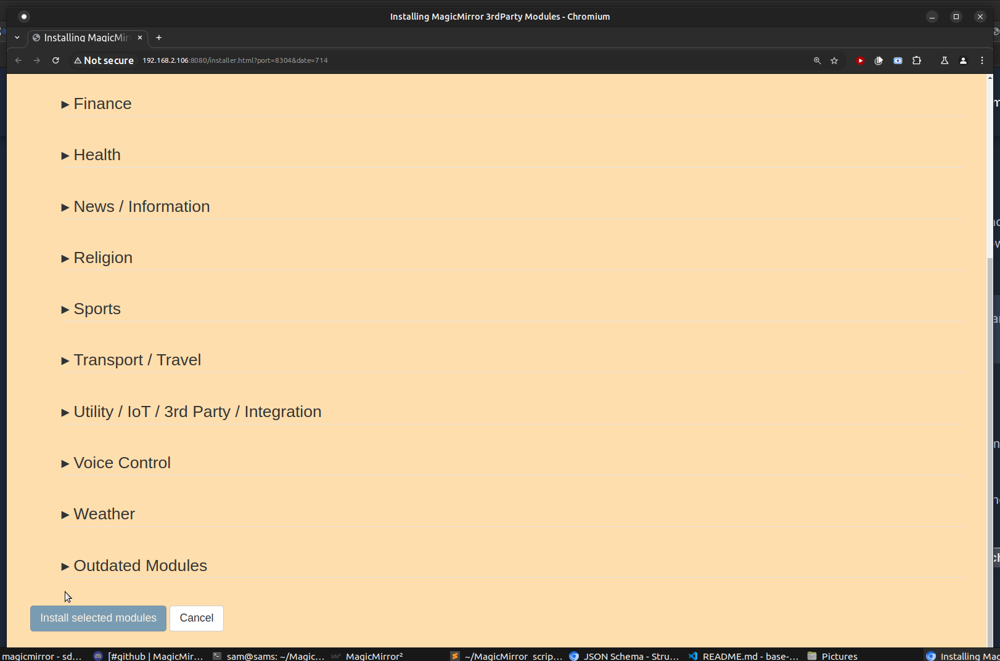
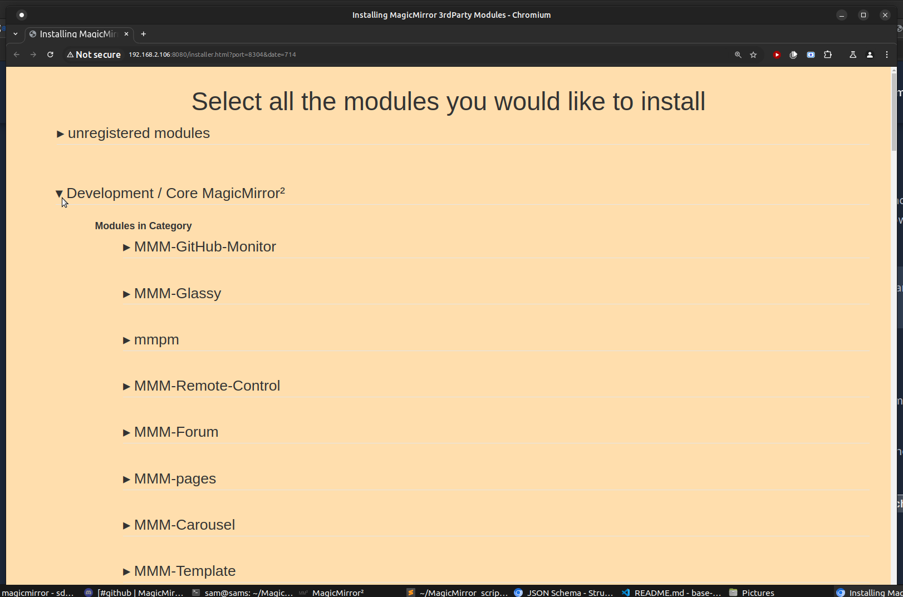
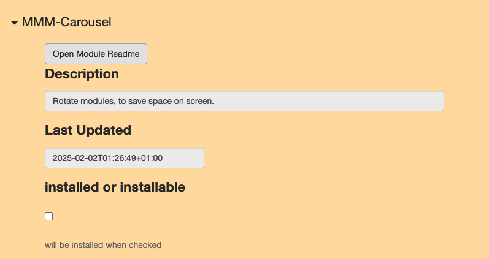
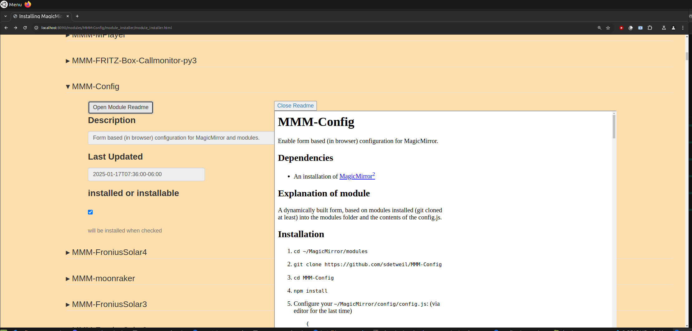
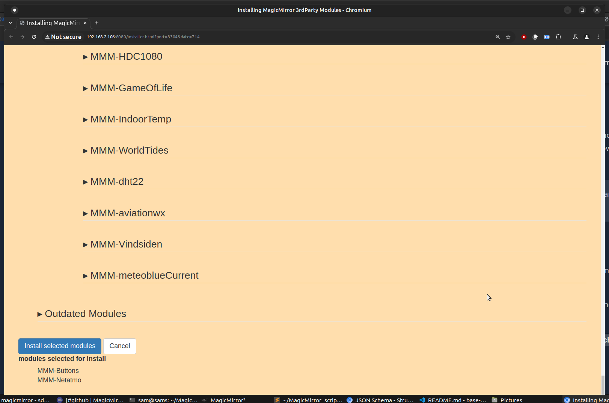

# MMM-Config

Enable form based (in browser) configuration for MagicMirror.

## Dependencies

* An installation of [MagicMirror<sup>2</sup>](https://github.com/MagicMirrorOrg/MagicMirror)

## Explanation of module

A dynamically built form, based on modules installed (git cloned at least) into the modules folder and the contents of the config.js.

and a module installer is provided as well , see [Module Installer](#minstaller) below

## Installation

1. `cd ~/MagicMirror/modules`
2. `git clone https://github.com/sdetweil/MMM-Config`
3. `cd MMM-Config`
4. `npm install`
5. Configure your `~/MagicMirror/config/config.js`: (via editor for the last time)

    ```
		{
			module:"MMM-Config",
			position:"top_right", 
				// the QR code (if requested) will appear here
			config:{

			}
		},
    ```

## Config Options (you can set/change all of these options in the form )

### All options are case sensitive

| **Option** | **Default** | **Default** | **Info**
| --- | --- | --- | --- |
| `showQR` | OPTIONAL | `false` | Show a QR code on the MM screen to allow quick access to the configuration form |
| | | ===> | **Otherwise, use a browser to open http://MM_IP_Address:MM_Port/modules/MMM-Config/review** |
| | | | `Note:` If MagicMirror is configured for `'address:"localhost"`, you `MUST use a browser ON the same system as MM`, and the QR code will be replaced by text on the screen explaining why the QRCode is not displayed
| `force_update` | OPTIONAL | false | Each time MM is started a scan is done of changed items, config.js and the modules folder. If either changed since last startup, then a new form is generated. If no changes, then the existing form is reused. Set to true `forces` a new form to be built on every MM startup |
| `ModuleSortOrder` | OPTIONAL | `date`	| this is used by the installer to organize the modules  in the installer list , either  by last update date or by `name`
| `restart` | OPTIONAL | none, static,  pm2, pm2:name/number, docker | If not 'none' (default), on save of config.js, MM will be restarted to use that new config file | managed_process.pm2_env

if you have multiple instances of MagicMirror running under pm2, and you want restart on save, look at the pm2 status output and get the unique name or number of the app, 
for example

pm2:MagicMirror1, or  pm2:0
this is particularly important if you are running multiple instances from the same MagicMirror folder with differnt config files,
you may specify only pm2, and the module will autodetect what app id to use

On form submission, a new config.js is constructed and saved, `AFTER` renaming the current config.js out of the way.  

The rename adds on the date and time the existing config.js was last modified.

The saved config.js filename will look like this `config.js.2021-05-04T10.01.27`.

The ':'  in the time is changed to '.' as Windows will not allow a filename with ':'.

MMM-Config uses the [jsonform](https://github.com/jsonform/jsonform/wiki) library to construct, present and operate  the form

### The form looks like this

Main form page. The form colors can be set in webform.css


The base expanded.


Modules expanded.

Module names in red are disabled or not in config.js.
Module names in blue are in config.js and enabled.
the top section are in config.js
once they all turn red, these are 'installed' in the modules folder, but not in config.js



a module expanded


### The Module Positions section


**Because the order of modules is top down by position, all the positioning is moved to this section of the form.**

**If u want a specific module first, select 1, second select 2, (consider date/time(1) above calendar(2))
if u don't care, select * (the default)**

**Disabled modules are left in config.js, just disabled.  Otherwise, we would lose the configuration information , like api keys, latitude/longitude, etc.**


# correcting or improving module presentation, seek the wiki link above


# Module installer<a name="minstaller"></a>


the module installer is a built in component of this module and can be opened by using the url 
```
http://mmserver_ip:mm_port/installer
```
###

#### it gets the list of modules from the 3rd party module list

* by default, the categories are sorted alphabetically, with the Outdated category moved to the bottom

* modules are sorted in category by `last date updated` by default
* * you can change this by changing the `ModuleSortOrder` config option

the installer page looks like this 


and the bottom looks like this


when the categories are expanded 



and a module expanded


and a module with readme open


the unregistered section looks like this 


as you select modules to be installed a list is maintained at the bottom 




* * if a module is already installed, its selection will be marked (and cannot be unselected)
* * this application will NOT remove modules.. you can disable them in the configurator (second step)

* * once the selection of modules is done,  press the<br> **Install selected modules** button

when the module installation(s) are completed, the MMM-Config screen will be opened for you to complete configuration 

once you have completed the configuration, press the **Save, Create config** button 


MMM-Config will try to restart your MagicMirror system after configuration is complete

if the MagicMirror instance is configured to auto restart due to config.js, that will happen naturally

if the MagicMirror instance is **NOT** configured to auto restart due to config.js, then the restart option will be used to restart 

if the MagicMirror instance is in a docker container, like khassel's
then the MagicMirror process will be killed, causing the container to restart 

if none of those options work, then you will have to restart the MagicMirror instance manually 


# styling the installer page

the css class names for the installer page components are

* unregistered
* * unregistedUrl
* category
* * moduleList
* * * moduleEntry
* * * * moduleName
* * * * moduleDescription
* * * * moduleLastUpdated
* moduleInstallList

None of these styles are set
and any changes go in MMM-Config/module_installer/local.css

note that these apply to ALL  modules,  and ALL unregistered URLs at the same time
so additional select clause elements would be required to target just some. 
(like modules in a particular category)

all changes go in
```
  MMM-Config/module_installer/local.css
```
